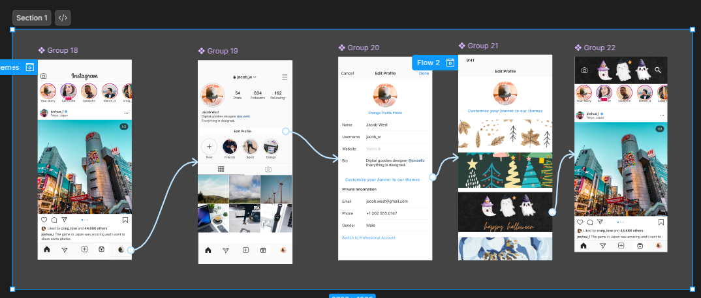
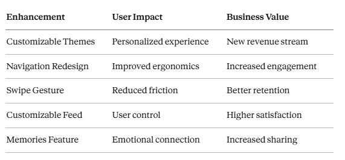

**Instagram Feature Enhancement Project**  

  

  

[Figma_Link]([https://example.com](https://www.figma.com/design/F6x7JsAlyagp1aozrWy8VP/Instagram---Project2?node-id=0-1&p=f&t=YZUHpElqhyD3h8OQ-0))

A comprehensive UX/UI redesign proposal focused on improving personalization, navigation, and user engagement on Instagram through five key feature enhancements. 

---

📋 **Table of Contents**  

Overview
User Personas
Feature Enhancements
Key Benefits
Project Documentation
Contributing
License

---

**🎯 Overview**  

This project explores and proposes strategic enhancements to Instagram's user experience based on comprehensive user research and persona analysis. The proposed features address common pain points while introducing new monetization opportunities and improved personalization options.  

--- 

**Project Goals**

Enhance user personalization and control over content
Improve navigation ergonomics and usability
Reduce user frustration with algorithmic content curation
Create new engagement touchpoints through nostalgia features
Generate revenue opportunities through premium customization

---

**👥 User Personas**

Our research identified three primary user archetypes that guided the enhancement strategy:

1. Mia Rodriguez - The Social Storyteller

Age: 22
Occupation: College Student (Communications Major)
Location: Austin, TX
Characteristics: Loves digital storytelling, campus events, and photography
Usage Pattern: Active content creator sharing daily life, travels, and food adventures
Primary Goal: Build community and express creativity through stories and reels

2. Priya Patel - The Entrepreneurial Creator

Age: 34
Occupation: Small Business Owner (Eco-friendly Jewelry Brand)
Location: Chicago, IL
Characteristics: Data-driven, strategic, customer-focused
Usage Pattern: Leverages Instagram for business growth, customer service, and community building
Primary Goal: Grow brand presence and engage with customers effectively

3. Ron Johnson - The Casual Browser

Age: 48
Occupation: High School Teacher
Location: Seattle, WA
Characteristics: Enjoys keeping up with friends, sports, and news
Usage Pattern: Prefers passive browsing with minimal engagement
Primary Goal: Stay connected without information overload

--- 

**🚀 Feature Enhancements**

Enhancement 1: Customizable Themes  

Location: Profile Settings → Customize Your Banner 

Problem: Instagram lacks personalization options, making the app feel generic. 

Solution: Customizable themes allow users to personalize their homepage aesthetics with both free and premium options. 

Key Benefits:  

&nbsp;&nbsp;&nbsp;&nbsp;  ✨ Enhanced Personalization  
&nbsp;&nbsp;&nbsp;&nbsp;  🌙 Improved User Experience (Dark Mode variations)  
&nbsp;&nbsp;&nbsp;&nbsp;  💰 Revenue Opportunity through premium theme subscriptions  

  

  

**Enhancement 2: Navigation Redesign**

Focus: Optimizing Icon Placement for Better User Flow  

Problem: Search icon in bottom bar requires uncomfortable thumb stretch on larger phones  

Messages in top bar occupies premium space despite being a secondary action  

Poor ergonomics with most-used features not optimally placed  

Solution: Swap Search and Messages icons to align with natural usage patterns and ergonomic thumb zones. 

Key Benefits:  

&nbsp;&nbsp;&nbsp;&nbsp; 👍 Improved Ergonomics - Bottom navigation optimized for one-handed use  
&nbsp;&nbsp;&nbsp;&nbsp; 🔍 Faster Search Access - Top bar placement enables quick discovery  
&nbsp;&nbsp;&nbsp;&nbsp; 💬 Messaging Convenience - Bottom placement makes DMs easier to reach  

  

  

**Enhancement 3: Swipe Gesture Redesign**

Focus: Streamlined Navigation - Swipe Right to Feed  

Problem: Instagram's swipe-right gesture currently opens Messages, disrupting users who are actively browsing content and creating friction when accidentally triggered.  

Solution: Redirect the swipe-right gesture from Messages to Feed, allowing seamless navigation between different content views.  

Key Benefits:  

&nbsp;&nbsp;&nbsp;&nbsp;  🌊 Seamless Browsing Flow  
&nbsp;&nbsp;&nbsp;&nbsp;  🎯 Behavior-Aligned Navigation  
&nbsp;&nbsp;&nbsp;&nbsp;  😌 Reduced User Frustration  

  

  

**Enhancement 4: Customizable Feed**

Focus: Personalized Content Discovery with Keyword Filters  

Location: Settings → Choose Your Feed  

Problem: Instagram's algorithm shows content based solely on past engagement, giving users no control over what appears in their feed. Users feel confused and overwhelmed.  

Solution: Keyword-based feed customization allows users to select topics of interest. Selected keywords appear as filterable pills at the top of the feed, enabling one-tap content filtering by topic. 

Key Benefits:  

&nbsp;&nbsp;&nbsp;&nbsp;  🎛️ User Control & Personalization  
&nbsp;&nbsp;&nbsp;&nbsp;  ⚡ Instant Content Filtering  
&nbsp;&nbsp;&nbsp;&nbsp;  🧹 Reduced Content Clutter  

  

  

**Enhancement 5: Memories Feature**

Focus: Relive Your Instagram Journey with Automatic Memories  

Location: Messages Page  

Problem: Instagram has no built-in way to rediscover old content. Users must manually scroll through their entire profile to find past posts.  

Solution: Automatic Memories feature surfaces posts and stories from 1-2 years ago, allowing users to relive, reshare, and download nostalgic content effortlessly.  

Key Benefits:  

&nbsp;&nbsp;&nbsp;&nbsp;  🔄 Automatic Surfacing - Past moments appear without manual scrolling  
&nbsp;&nbsp;&nbsp;&nbsp;  📤 One-Tap Sharing - Share memories to Story with date stickers  
&nbsp;&nbsp;&nbsp;&nbsp;  💾 Easy Downloads - Save memories directly to device  

  

  

📊 Key Benefits Summary

  

  
